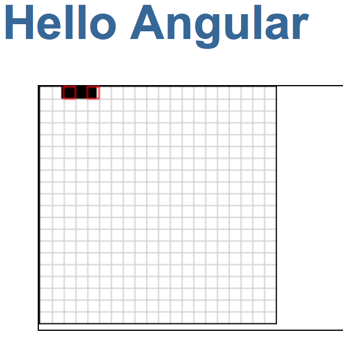

[![Build Status][travis-badge]][travis-badge-url]

# Angular Snake Xenzia

The end goal of this project is to emulate the Snake Xenzia game as seen on
the Nokia X1 phone.

So far this project was initiated using the [Angular quickstart seed](https://angular.io/docs/ts/latest/quickstart.html). It then incorporates
a canvas as demonstrated in the [angular2-canvas-examples project](https://github.com/sflahave/angular2-canvas-examples).

Install and run with:

```bash
npm install
npm start
```

After the `npm start` you should see:


## Plan to progress this project
* Create project using the angular / quickstart seed
* Draw a canvas as done in sflahave / angular2-canvas-examples
* Copy and paste code from the nirkaufman / angular-snake project
  - Respond to click events
  - Respond to key events
  - introduce a snake class to:
      - memorize the traveling direction,
      - current length
      - overall position in the grid
      - crossing functions
      - pixel distance between head position and square center
  - introduce a grid class to:
      - present itself as a discreet positioning system going from zero to n
        where n takes into account the width of the drawn grid and the width of
        the snake.
  - introduce a drawer to:
      - draw the grid
      - draw the snake
* Update grid to allow snake to cross top, right, bottom and left borders
* Draw the snake with red and yellow squares
* Drop one big red dot of food for every 5 standard dots consumed
* Add a timer to the big red dot, reduce bonus points, as time goes, and
  make big red dot disappear when the time is off
* Create a site with the game as demo
* Test on mobile and tablet
* Find a way to indicate up, right, down and left directions for tablets
* Add an intro screen
* Make the snake look better

[angular-testing-guide]:
https://angular.io/docs/ts/latest/guide/testing.html#!#atu-apis

[angular-testing-guide-gerard-sans]:
https://medium.com/google-developer-experts/angular-2-testing-guide-a485b6cb1ef0#.dag7emp4q

[svg-canvas-in-angular2]:
https://teropa.info/blog/2016/12/12/graphics-in-angular-2.html


[travis-badge]: https://travis-ci.org/adelinor/angular-snake-xenzia.svg?branch=master
[travis-badge-url]: https://travis-ci.org/adelinor/angular-snake-xenzia
